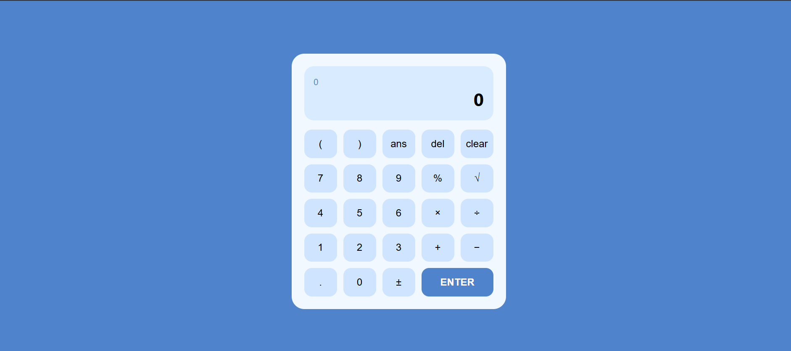
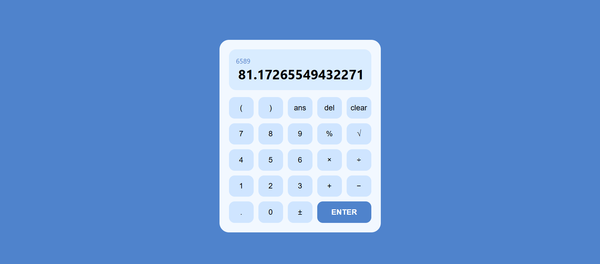

# Advanced Calculator 

## 📌 Project Overview
This project is an advanced calculator developed using HTML, CSS, and JavaScript.  
It provides a modern user interface and supports multiple arithmetic operations.

## 🎯 Features
- Addition, Subtraction, Multiplication, Division
- Percentage calculation
- Square root operation
- Brackets support
- Ans (memory) functionality
- Clear & Delete buttons
- Error handling
- Responsive and modern UI

## 🛠️ Technologies Used
- HTML
- CSS (Grid Layout)
- JavaScript (Event Handling & Logic)

## 📸 Screenshots
### Calculator Interface

### Working Example

## 🌐 Live Demo
👉 https://mantechie.github.io/Calc/

## 👨‍💻 Developer
- Name: Manan Sharma
