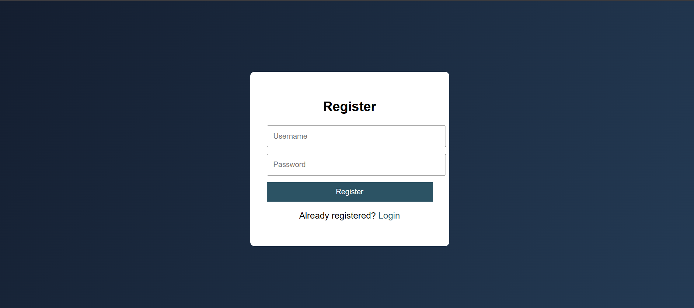
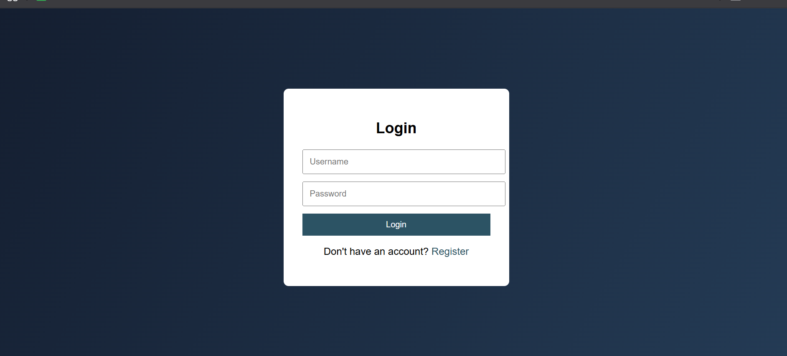
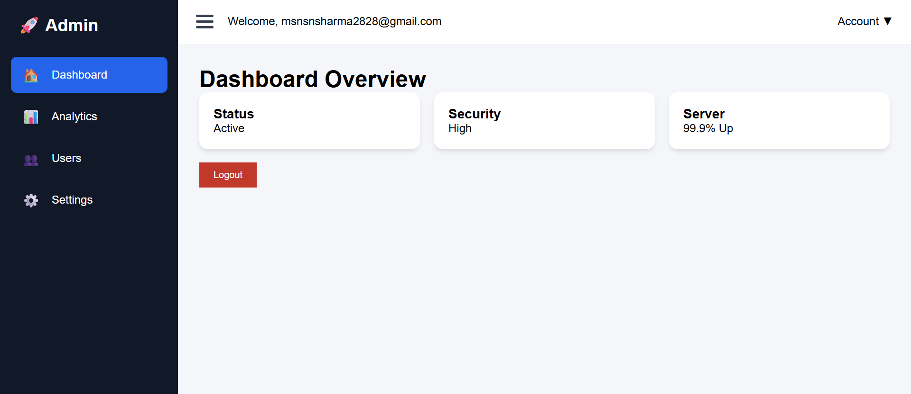

# Login Authentication System 

## 📌 Project Overview
This project implements a simple login authentication system using HTML, CSS,
and JavaScript. Users can register, login, and access a secured dashboard page.

## 🎯 Features
- User registration
- Login authentication
- Secured dashboard page
- Logout functionality
- Client-side session handling

## 🛠️ Technologies Used
- HTML
- CSS
- JavaScript (localStorage)

## 📸 Screenshots

## 👨‍💻 Developer
- Name: Manan
