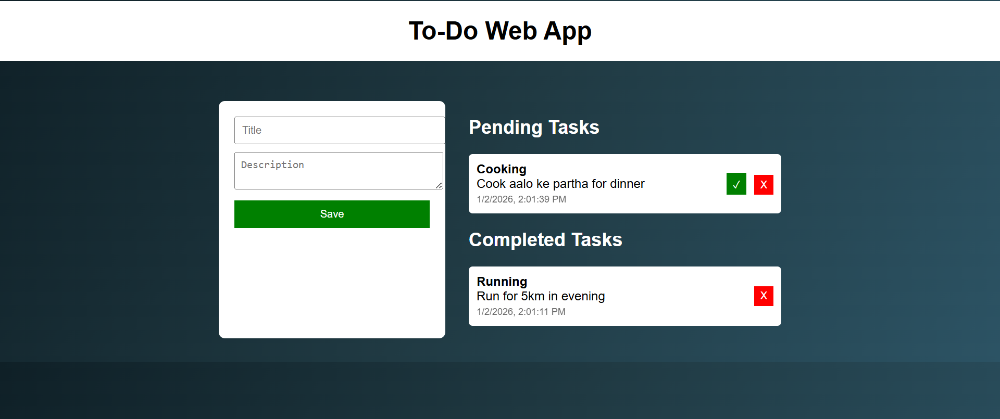

# To-Do Web App 

## 📌 Project Overview
This is a basic to-do web application developed using HTML, CSS, and JavaScript.
Users can add daily tasks, mark them as completed, and delete tasks.

## 🎯 Features
- Add task with title & description
- Pending and Completed task sections
- Mark task as complete
- Delete tasks
- Date & time tracking
- Clean UI design

## 🛠️ Technologies Used
- HTML
- CSS
- JavaScript

## 📸 Screenshots

## 👨‍💻 Developer
- Name: Manan
